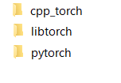
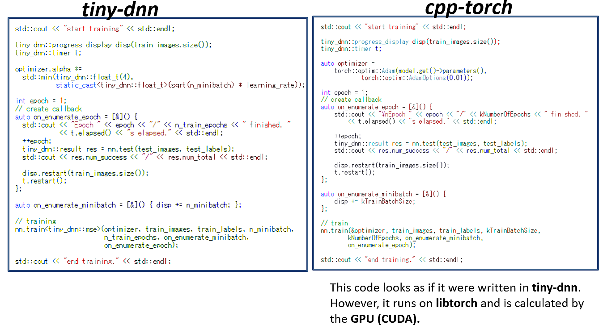
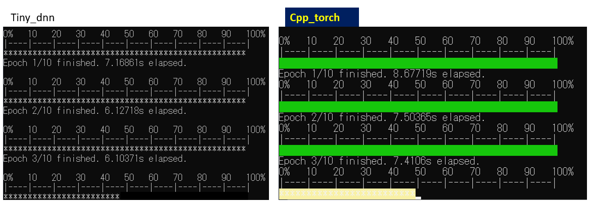
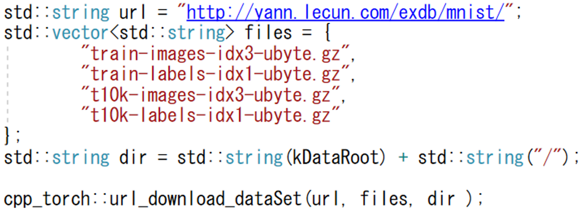
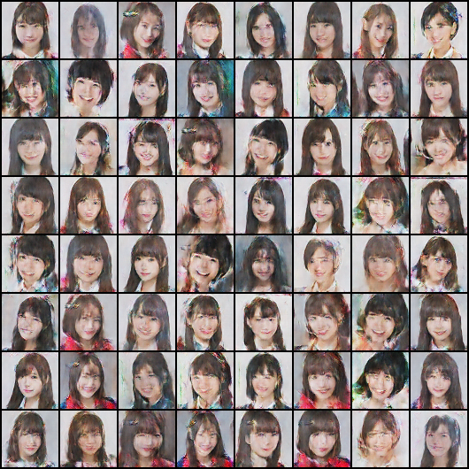
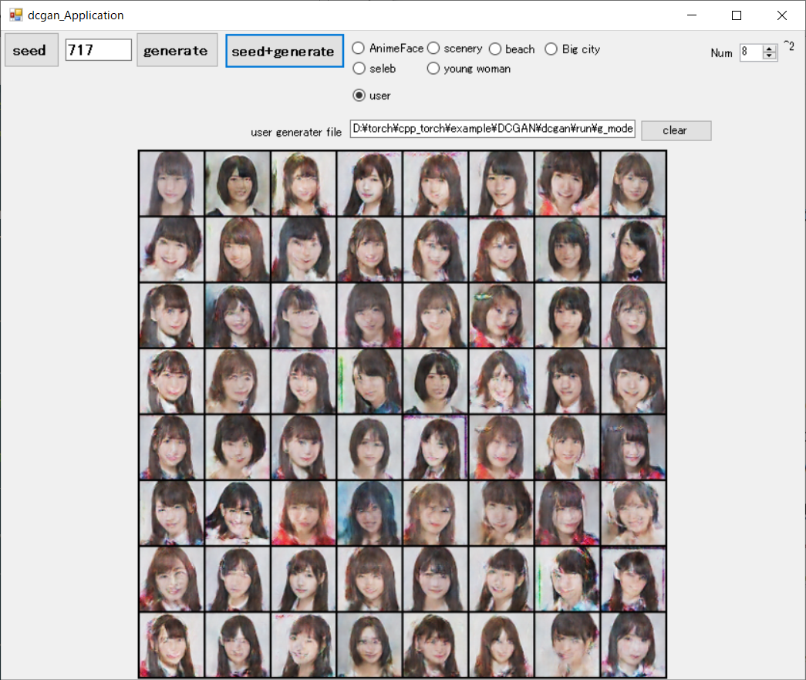

# [**tiny-dnn**](https://github.com/tiny-dnn/tiny-dnn) based on  [libtorch](https://pytorch.org/get-started/locally/) 

**header only, deep learning framework with no dependencies other than libtorch**  

Directory structure
  

This project aims to be a wrapper for libtorch to make [**tiny-dnn**](https://github.com/tiny-dnn/tiny-dnn) compatible with GPU.
[**tiny-dnn**](https://github.com/tiny-dnn/tiny-dnn) really great, but unfortunately it can not be calculated on a GPU.
At first glance, this header-only framework aims to be used as written in [**tiny-dnn**](https://github.com/tiny-dnn/tiny-dnn).

  


**Include path settings**  
```
Libtorch_path/include
Libtorch_path/include/torch/csrc/api/include
cpp_torch_path
cpp_torch_path/include
```
**Library path setting**  
```
Libtorch_path/lib
cpp_torch_path
```

**Minimum include file**  
```
#include "cpp_torch.h"
```
**progress**  
*tiny_dnn*  
```
tiny_dnn::progress_display disp(train_images.size());
```
  
*cpp_torch*
```
cpp_torch::progress_display disp(train_images.size());
```

cpp_torch::progress_display disp(train_images.size());  
  

**data set download**  
What you can do is still limited.  


# config.h  
|options|description|default||
|-----|-----|----|----|
|USE_WINDOWS||ON||
|USE_COLOR_CONSOLE||ON||
|USE_ZLIB||ON||
|USE_IMAGE_UTIL||ON||
|USE_OPENCV_UTIL|[OpenCV](https://opencv.org/releases/) >= 2.3|OFF|ex. C:\dev\opencv-3.4.0|

## example
MNIS  
CIFAR10  
[DCGAN](./cpp_torch/example/DCGAN/readme.md)  

## Latest topic  
Do you have a favorite cute person?  
  
This app was created with C # for GUI and C ++ only for core processing. Python is not required.  
  


## [previous topic](./cpp_torch/previous.md)

## Requirements  
visual studio 2015,2017  

[libtorch](https://pytorch.org/get-started1locally/)
**Please adapt the version of cuda to your environment**  


## tiny-dnn
[BSD 3-Clause License Copyright (c) 2013, Taiga Nomi](https://github.com/tiny-dnn/tiny-dnn)  

*tiny_dnn* was good, but unfortunately development has clearly stopped. Therefore, we created cpp_torch that can be used instead.  

> ```
> If you are building in C++,
> Even if Python or pytorch (libtorch) is changed Should work.  
> 
> Will the Python app function correctly next month?  
> Is there a guarantee that customers will not update python, etc.?
> ```
