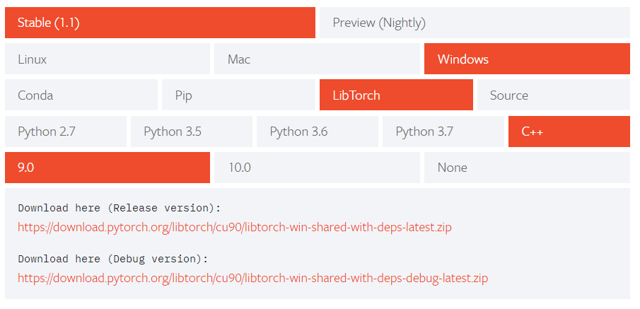

# cpp_torch
## [libtorch](https://pytorch.org/get-started/locally/) atVisual Studio C++  

Directory structure
  

## Requirements  
visual studio 2015,2017  

[libtorch](https://pytorch.org/get-started1locally/)
**Please adapt the version of cuda to your environment**  
  