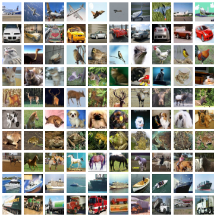

 **Object Recognition in Images**  
 
 [**CIFAR10**](https://www.cs.toronto.edu/~kriz/cifar.html)  

  

**Download**  
[CIFAR-10 binary version (suitable for C programs)](https://www.cs.toronto.edu/~kriz/cifar-10-binary.tar.gz)

accuracy:**84.15%**  
data augment 50000 -> 250000  
kaggle Top **19%** 44/231 teams  
