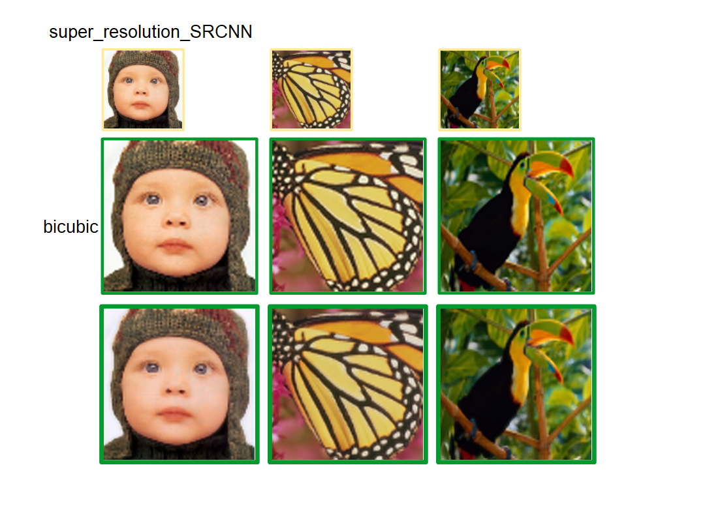

## training
1. Copy of DLL required for execution
   **setup_copy_dll.bat**

2. Training data placement  
Data directory is **run/data**  

3. Execution
   **run.bat**

**Training data**  
 [DATA SET](http://www2.eecs.berkeley.edu/Research/Projects/CS/vision/bsds/BSDS300-images.tgz)  
 [Set5](https://uofi.box.com/shared/static/kfahv87nfe8ax910l85dksyl2q212voc.zip)

