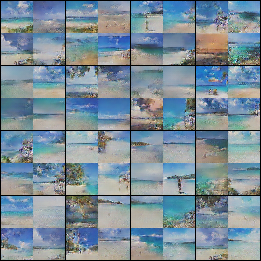
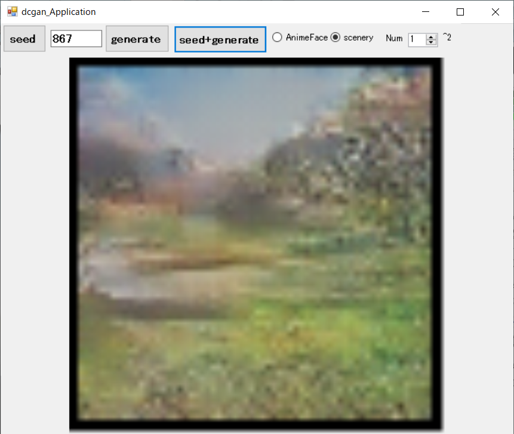
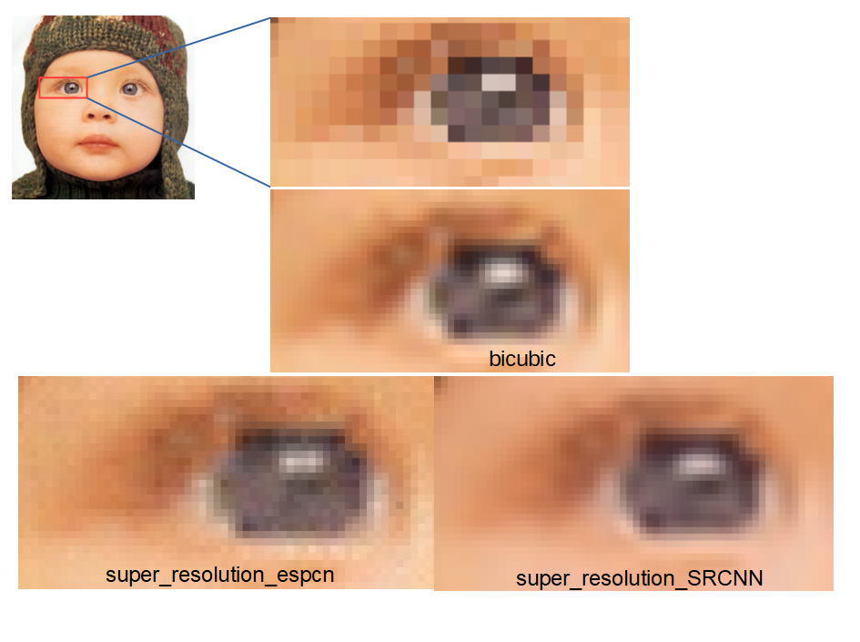
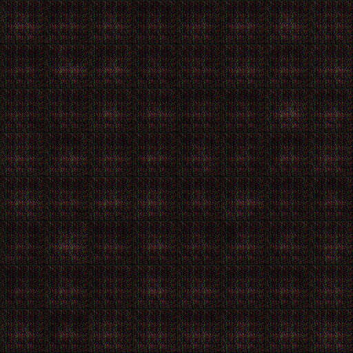
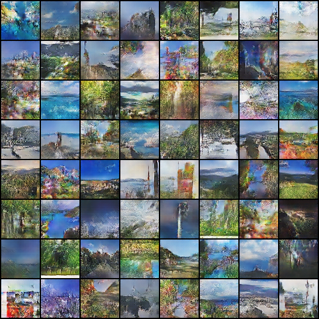

# [**tiny-dnn**](https://github.com/tiny-dnn/tiny-dnn) based on  [libtorch](https://pytorch.org/get-started/locally/) 

**header only, deep learning framework with no dependencies other than libtorch**  

## previous topic  
Beautiful beach?  
  

C# applicatin example  
  
##### This application is in [cpp_torch/example/app/dcgan_Application](./example/app/dcgan_Application)

``C++`` only **super_resolution**  (train & test)  
60epochs  
It's still being verified  
**[ESPCN(Efficient SubPixel Convolutional Neural Network)](./cpp_torch/test/super_resolution_espcn/readme.md)**  
**[SRCNN(Super-Resolution Convolutional Neural Network)](./cpp_torch/test/super_resolution_srcnn/readme.md)**  
##### This application is in [cpp_torch/example/app/super_resolution_Application](./example/app/super_resolution_Application)

``C++``  only **DCGAN(Deep Convolutional Generative Adversarial Network)** (train & test) [reference](https://qiita.com/hokuto_HIRANO/items/7381095aaee668513487)
  
It was not possible with **tiny-dnn**, but it became possible with **cpp_torch(libtorch)**.
  
